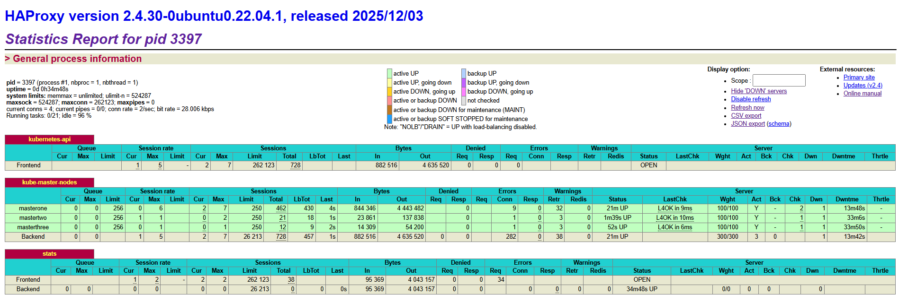
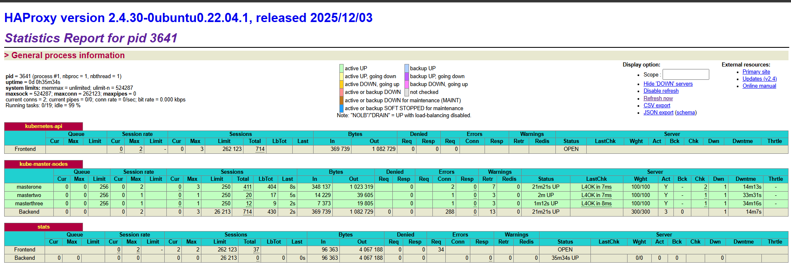

### Configuring Load Balancer(HAProxy) and Virtual IP(Keepalive)

#### Update repo and system
```bash
sudo apt-get update -y
```

#### Install HAProxy
```bash
sudo apt-get install haproxy keepalived curl -y
```

#### Health-check script (ON BOTH LB NODES)
```bash
mkdir -p /etc/keepalived/
cat > /etc/keepalived/check_apiserver.sh <<'EOF'
#!/bin/sh

errorExit() {
  echo "*** $@" 1>&2
  exit 1
}

# Check HAProxy locally
curl --silent --max-time 2 --insecure https://localhost:6443/ -o /dev/null \
  || errorExit "HAProxy is not responding on localhost:6443"

# If this node owns the VIP, verify VIP access
if ip addr | grep -q 172.16.16.100; then
  curl --silent --max-time 2 --insecure https://172.16.16.100:6443/ -o /dev/null \
    || errorExit "VIP 172.16.16.100:6443 is not responding"
fi

exit 0
EOF

chmod +x /etc/keepalived/check_apiserver.sh
```

#### Keepalived configuration

##### LB1 (PRIMARY)
```bash
cat > /etc/keepalived/keepalived.conf <<'EOF'
vrrp_script check_apiserver {
    script "/etc/keepalived/check_apiserver.sh"
    interval 3
    timeout 10
    fall 5
    rise 2
    weight -10
}

vrrp_instance VI_1 {
    state MASTER
    interface eth1
    virtual_router_id 51
    priority 101
    advert_int 1

    authentication {
        auth_type PASS
        auth_pass K8S_LB_SECRET
    }

    virtual_ipaddress {
        172.16.16.100
    }

    track_script {
        check_apiserver
    }
}
EOF
```

##### LB2 (SECONDARY)
```bash
cat > /etc/keepalived/keepalived.conf <<'EOF'
vrrp_script check_apiserver {
    script "/etc/keepalived/check_apiserver.sh"
    interval 3
    timeout 10
    fall 5
    rise 2
    weight -10
}

vrrp_instance VI_1 {
    state BACKUP
    interface eth1
    virtual_router_id 51
    priority 100
    advert_int 1

    authentication {
        auth_type PASS
        auth_pass K8S_LB_SECRET
    }

    virtual_ipaddress {
        172.16.16.100
    }

    track_script {
        check_apiserver
    }
}
EOF
```

#### HAProxy configuration (ON BOTH LB NODES)
```bash
cat <<EOF >> /etc/haproxy/haproxy.cfg
#add these lines at bottom of file <respect the indents>
frontend kubernetes-api
         bind *:6443
         mode tcp
         option tcplog
         default_backend kube-master-nodes

backend kube-master-nodes
        mode tcp
        balance roundrobin
        option tcp-check
        default-server inter 10s downinter 5s rise 2 fall 2 slowstart 60s maxconn 250 maxqueue 256 weight 100
        server masterone 192.168.29.51:6443 check
        server mastertwo 192.168.29.52:6443 check
        server masterthree 192.168.29.53:6443 check
EOF
```

#### Enable HAProxy Stats
```bash
#Edit the HAProxy configuration file:
cat <<EOF >> /etc/haproxy/haproxy.cfg
#Add the following configuration at the end of the file:
listen stats
    bind *:8404
    mode http
    stats enable
    stats uri /
    stats refresh 10s
EOF

```

#### Restart haproxy and check
```bash
systemctl enable haproxy keepalived
systemctl restart haproxy keepalived

systemctl status haproxy keepalived

#Check if the port 6443 is open and responding for haproxy connection or not
ss -lntp | grep 6443
ss -tulnp | grep -i 8404
nc -v localhost 6443

#Access the HAProxy stats page in a browser:
http://LOAD_BALANCER_IP:8404
```

#### Check VIP location
```bash
ip a | grep 172.16.16.100
```

#### Test failover
```bash
On LB1:
    systemctl stop keepalived
On LB2:
    ip a | grep 172.16.16.100
VIP should move to LB2 automatically.
```

```bash
root@lbone:~# ss -tulnp | grep -i 8404
tcp   LISTEN 0      4096                           0.0.0.0:8404      0.0.0.0:*    users:(("haproxy",pid=24325,fd=7))
root@lbone:~# ss -lntp | grep 6443
LISTEN 0      4096         0.0.0.0:6443      0.0.0.0:*    users:(("haproxy",pid=24325,fd=6))
root@lbone:~# nc -v localhost 6443
Connection to localhost (127.0.0.1) 6443 port [tcp/*] succeeded!
```



